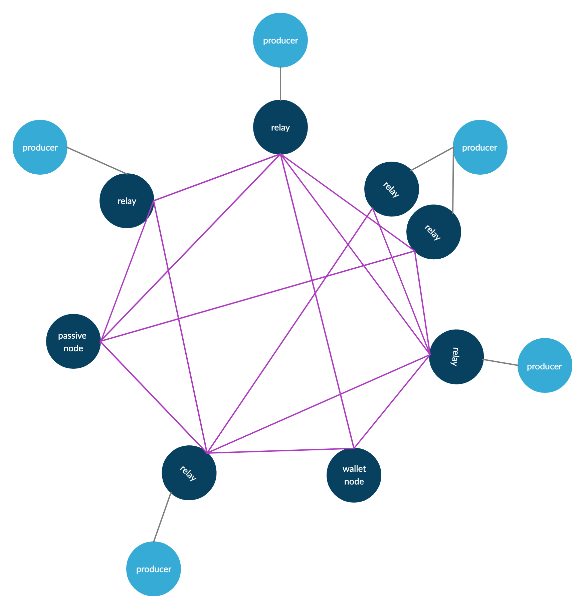

# Configuring Stake Pool Topology

Network topology describes the physical and logical structure of a network. In the Cardano network, each stake pool must operate at least one block-producing node and one relay node. The keys and certificates required to issue blocks are located on the block-producing node. For security reasons, your block producer must connect **only** to one or more relay nodes that you control, as the operator of your stake pool.

The following diagram illustrates Cardano network topology:



<!-- Reference:
https://iohk.zendesk.com/hc/en-us/articles/900001219843-What-are-Block-producing-nodes-and-relay-nodes -->

Before you start the nodes comprising your stake pool, you must:

- Configure your block-producing node to connect only with your relay node(s)
- Configure your relay node(s) to connect with your block-producing node

## Configuring Your Block-producing Node

**To configure your block-producing node to connect only with your relay node(s):**

1. 

On your **block-producer** node, run the following. Update the **addr** with your relay node's IP address.


**What IP address to use?**

* If both block producer and relay nodes are a local network, then use the relay node's local IP address. `i.e. 192.168.1.123`
* If you are running all nodes in the cloud/VPS , then use the relay node's public IP address. `i.e. 173.45.12.32`
* If your block producer node is local and relay node is in the cloud, then use the relay node's public IP address. `i.e. 173.45.12.32`



To improve performance and security of your stake pool, use the local area network (LAN) Internet protocol (IP) address of the computer whenever possible. If necessary, use the wide area network (WAN) IP address.




```bash
cat > $NODE_HOME/${NODE_CONFIG}-topology.json << EOF 
 {
    "Producers": [
      {
        "addr": "<RELAYNODE1'S IP ADDRESS>",
        "port": 6000,
        "valency": 1
      }
    ]
  }
EOF
```



## Configuring a Relay Node

**To configure your relay node(s) to connect with your block-producing node:**

1. 


:construction: On your other server that will be designed as your relay node or what we will call **relaynode1** throughout this guide, carefully **repeat steps in Part 1  Installation** in order to build the cardano binaries.



You can have multiple relay nodes as you scale up your stake pool architecture. Simply create **relaynodeN** and adapt the guide instructions accordingly.


On your **relaynode1**, run the following after updating with your block producer's IP address.


**What IP address to use?**

* If both block producer and relay nodes are on a local network, then use the local IP address. `i.e. 192.168.1.123`
* If you are running on a cloud or VPS configuration, then use the block producer's public IP address. `i.e. 173.45.12.32`
* If your block producer node is local and relay node is in the cloud, then use the block producer's public IP address (also known as your local network's public IP address). `i.e. 173.45.12.32`



To improve performance and security of your stake pool, use the LAN IP address of the computer whenever possible. If necessary, use the WAN IP address.




```bash
cat > $NODE_HOME/${NODE_CONFIG}-topology.json << EOF 
 {
    "Producers": [
      {
        "addr": "<BLOCK PRODUCER NODE'S IP ADDRESS>",
        "port": 6000,
        "valency": 1
      },
      {
        "addr": "relays-new.cardano-mainnet.iohk.io",
        "port": 3001,
        "valency": 2
      }
    ]
  }
EOF
```




Valency tells the node how many connections to keep open. Only DNS addresses are affected. If value is 0, then the address is ignored.


<!-- Reference:
https://forum.cardano.org/t/question-about-valency/35696 -->


Connecting your relay node(s) with IOHK relays at `relays-new.cardano-mainnet.iohk.io` allows the nodes in your stake pool to synchronize with the blockchain.


9. To configure additional relay nodes, repeat steps 1 to 8 for each additional relay node in your stake pool configuration.

## Configuring Port Forwarding

Port forwarding creates an association between the public WAN IP address of a router and a private LAN IP address dedicated to a computer or device on the private network that the router manages.
<!-- Reference:
https://learn.g2.com/port-forwarding -->

So that relay nodes in the Cardano network can connect to a relay node in your stake pool configuration, in your firewall configuration you must open a port and forward traffic received on the port to the port where the relay node listens.
<!-- Reference:
https://customer.cradlepoint.com/s/article/How-to-Do-Port-Forwarding-To-Multiple-Devices-on-the-Same-Port -->


In the topology configuration examples above, all block-producing and relay nodes in the stake pool configuration listen on port 6000 If you followed Coin Cashew instructions for [Configuring Your Firewall](../part-i-installation/hardening-an-ubuntu-server.md#ufw), then also ensure that in `ufw` you allow incoming traffic on the port where the Cardano node on the local computer listens, as needed.


To help confirm that your ports are configured as needed, you can use the [Port Forwarding Tester](https://www.yougetsignal.com/tools/open-ports/) or [CanYouSeeMe.org](https://canyouseeme.org/) for example.

## Next Steps

While the topology configuration described above allows your nodes to synchronize with the blockchain, operating a stake pool requires that your relay node(s) also connect with additional relay nodes in the Cardano network. Prior to [Configuring Network Topology](../part-iii-operation/configuring-network-topology.md), the _How to Set Up a Cardano Stake Pool_ guide explains other tasks that you must complete first, such as [Configuring an Air-gapped, Offline Computer](./configuring-an-air-gapped-offline-computer.md).