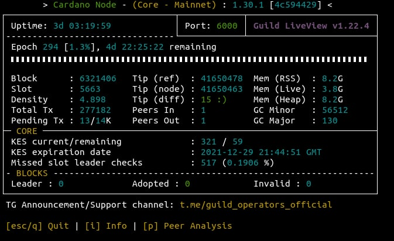

# Starting the Nodes

Start your stake pool with systemctl and begin syncing the blockchain!


:construction: You can have multiple relay nodes as you scale up your stake pool architecture. In the Coin Cashew guide, for convenience procedures may refer to your relay nodes using the name `relaynode<N>` where `<N>` is `1` for your first relay, `2` for your second relay, and so on. Simply create `relaynode<N>` and adapt the guide instructions accordingly.




```bash
sudo systemctl start cardano-node
```



```bash
sudo systemctl start cardano-node
```



## <a name="gliveview"></a>Installing gLiveView

Install gLiveView, a monitoring tool.


gLiveView displays crucial node status information and works well with systemd services.


```bash
cd $NODE_HOME
sudo apt install bc tcptraceroute -y
curl -s -o gLiveView.sh https://raw.githubusercontent.com/cardano-community/guild-operators/master/scripts/cnode-helper-scripts/gLiveView.sh
curl -s -o env https://raw.githubusercontent.com/cardano-community/guild-operators/master/scripts/cnode-helper-scripts/env
chmod 755 gLiveView.sh
```

Run the following to modify **env** with the updated file locations.

```bash
sed -i env \
    -e "s/\#CONFIG=\"\${CNODE_HOME}\/files\/config.json\"/CONFIG=\"\${NODE_HOME}\/mainnet-config.json\"/g" \
    -e "s/\#SOCKET=\"\${CNODE_HOME}\/sockets\/node0.socket\"/SOCKET=\"\${NODE_HOME}\/db\/socket\"/g"
```


For complete documentation from the developer on using the [gLiveView](https://cardano-community.github.io/guild-operators/Scripts/gliveview/) script and [env](https://cardano-community.github.io/guild-operators/Scripts/env/) file, visit [Guild Operators](https://cardano-community.github.io/guild-operators/).



A node must synchronize to epoch 208 (Shelley launch) before **gLiveView.sh** can start tracking the synchronization process. Before your node synchronizes to epoch 208, you can track node synchronization using the following command:

```
journalctl --unit=cardano-node --follow
```



****:sparkles: **Pro tip**: If you synchronize a node, then you can copy the database directory to a different computer to save time synchronizing another node.


Run gLiveView to monitor the progress of the node synchronizing with the blockchain.

```
./gLiveView.sh
```

Sample output of gLiveView.




Congratulations! Your node is running successfully now. Let it sync up.

