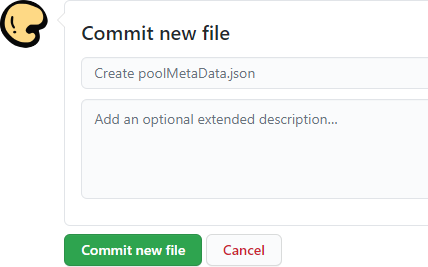

# Uploading Pool Metadata to GitHub

**To host the file containing metadata for your pool on GitHub:**

1. Sign up for a [GitHub](https://github.com) account.
2. Create a **new repository** with a short name
3. Click Get started by "**creating a new file**"\
   
4. Enter your file name as **poolMetaData.json** and paste in your JSON content.\
   
5. Click **Commit New File**\
   
6. Click your new file's name
7. Click the **Raw** button.
8. Copy the URL into your clipboard


Example: [https://raw.githubusercontent.com/coincashew/test/master/poolMetaData.json](https://raw.githubusercontent.com/coincashew/test/master/poolMetaData.json)


1. If the URL that you copied in step 8 is longer than 64 characters, then use [TinyURL](https://tinyurl.com/app) to shorten the URL.
2. In your stakepool registration transaction, set the value of the `--metadata-url` parameter to a URL having a length of less than 64 characters.
3. On your block producer node, download your JSON file from your git.io URL using the `wget` command:

```bash
cd $NODE_HOME
wget -O poolMetaData.json <your git.io link>
```


git.io may change your JSON file by removing spaces and new lines. Download your JSON file to ensure that the metadata hash you calculate in step 12 is correct.


12\. On your block producer node, generate the updated pool metadata hash. \`\`\`bash cardano-cli stake-pool metadata-hash --pool-metadata-file poolMetaData.json > poolMetaDataHash.txt \`\`\`
