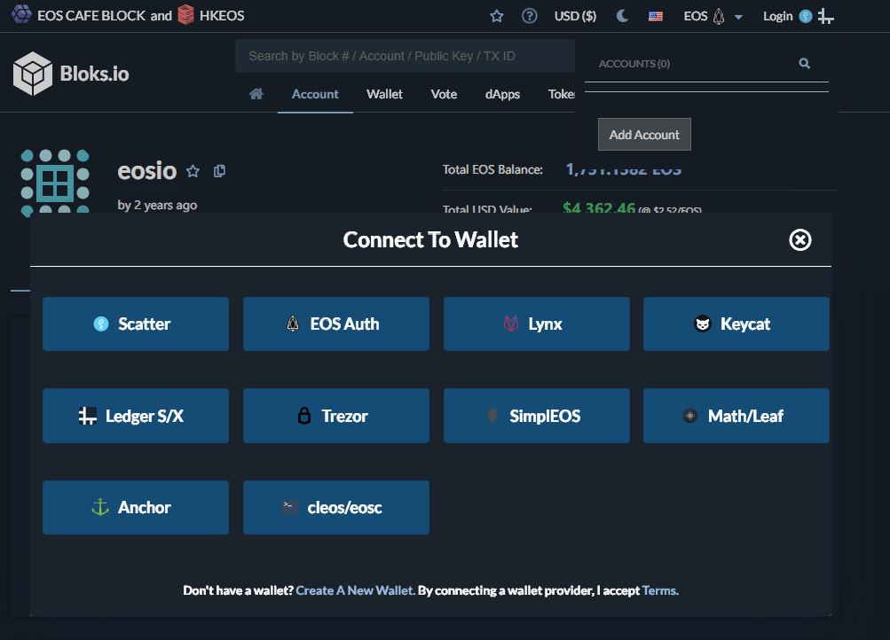
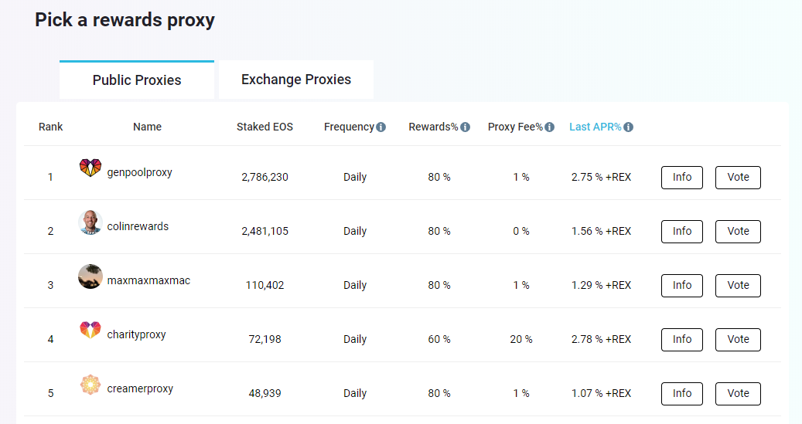

# Guide: How to stake EOS

## :checkered\_flag: 1. Prerequisites

EOS tokens stored on a local wallet. You control the seed/private keys.&#x20;


Remember, it's best practice to always withdraw coins from an Exchange.


## :confetti\_ball: 2. Delegate your stake

1\. **Open** in your web browser: [Bloks.io](https://bloks.io/account/eosio)


Bloks.io will be the quickest way to stake and is safe because your coins never leave your control.


2\. For this example, we will delegate with Ledger Nano S/X.

3\. Click on the **Login button** in the top right.

4\. Select the type of wallet you have.&#x20;

* In this example, **plug** in your Ledger, **type** the PIN code, **open** the EOS app.
* then in the browser, **click** Ledger S/X .

5\. Click **Vote tab**

6\. Click **Proxies tab**


Maximize your EOS token potential by finding the right proxy for you. [Genpool.io has a handy listing.](https://genpool.io/public-proxy)


7\. Enter your desired **proxy's name**

8\. Click **Proxy to ...** button

9\. **Confirm** the transaction on your Ledger

10\. :tada: Congratulations. Rewards will start showing up every day. Check your rewards on the **Account tab**.

## :mag\_right: 3. Monitoring your rewards proxy

To learn more about your proxy, use these amazing community created tools.

* [Bloks.io](https://bloks.io/account/eosio) - EOS block explorer built by EOS Cafe Block and HKEOS
