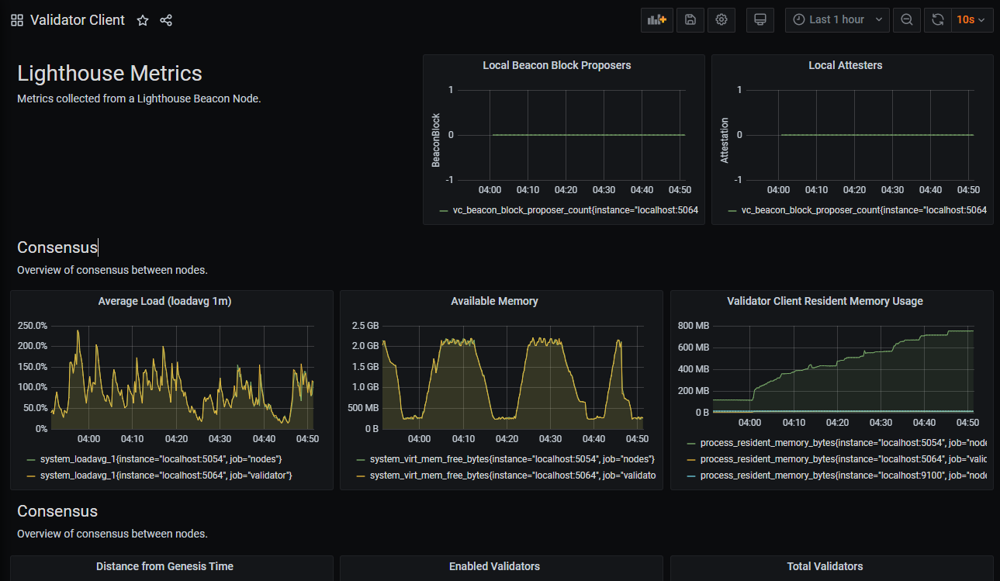
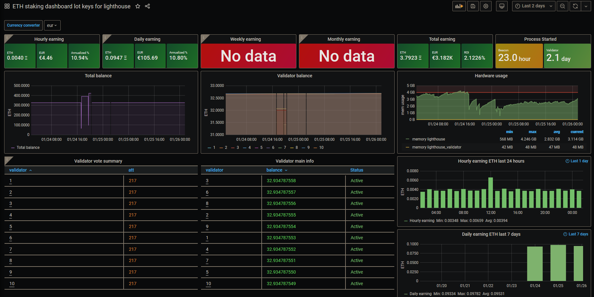

# Monitoring your validator with Grafana and Prometheus

Prometheus is a monitoring platform that collects metrics from monitored targets by scraping metrics HTTP endpoints on these targets. [Official documentation is available here.](https://prometheus.io/docs/introduction/overview/) Grafana is a dashboard used to visualize the collected data.

### 6.1 Installation

Install prometheus and prometheus node exporter.

```
sudo apt-get install -y prometheus prometheus-node-exporter
```

Install grafana.

```bash
wget -q -O - https://packages.grafana.com/gpg.key | sudo apt-key add -
echo "deb https://packages.grafana.com/oss/deb stable main" > grafana.list
sudo mv grafana.list /etc/apt/sources.list.d/grafana.list
sudo apt-get update && sudo apt-get install -y grafana
```

Enable services so they start automatically.

```bash
sudo systemctl enable grafana-server.service prometheus.service prometheus-node-exporter.service
```

Create the **prometheus.yml** config file. Choose the tab for your eth client. Simply copy and paste.



```bash
cat > $HOME/prometheus.yml << EOF
global:
  scrape_interval:     15s # By default, scrape targets every 15 seconds.

  # Attach these labels to any time series or alerts when communicating with
  # external systems (federation, remote storage, Alertmanager).
  external_labels:
    monitor: 'codelab-monitor'

# A scrape configuration containing exactly one endpoint to scrape:
# Here it's Prometheus itself.
scrape_configs:
   - job_name: 'node_exporter'
     static_configs:
       - targets: ['localhost:9100']
   - job_name: 'nodes'
     metrics_path: /metrics    
     static_configs:
       - targets: ['localhost:5054']
   - job_name: 'validators'
     metrics_path: /metrics
     static_configs:
       - targets: ['localhost:5064']
EOF
```



```bash
cat > $HOME/prometheus.yml << EOF
global:
  scrape_interval:     15s # By default, scrape targets every 15 seconds.

  # Attach these labels to any time series or alerts when communicating with
  # external systems (federation, remote storage, Alertmanager).
  external_labels:
    monitor: 'codelab-monitor'

# A scrape configuration containing exactly one endpoint to scrape:
# Here it's Prometheus itself.
scrape_configs:
   - job_name: 'node_exporter'
     static_configs:
       - targets: ['localhost:9100']
   - job_name: 'nodes'
     metrics_path: /metrics    
     static_configs:
       - targets: ['localhost:8008']
EOF
```



```bash
cat > $HOME/prometheus.yml << EOF
global:
  scrape_interval:     15s # By default, scrape targets every 15 seconds.

  # Attach these labels to any time series or alerts when communicating with
  # external systems (federation, remote storage, Alertmanager).
  external_labels:
    monitor: 'codelab-monitor'

# A scrape configuration containing exactly one endpoint to scrape:
# Here it's Prometheus itself.
scrape_configs:
   - job_name: 'node_exporter'
     static_configs:
       - targets: ['localhost:9100']
   - job_name: 'nodes'
     metrics_path: /metrics    
     static_configs:
       - targets: ['localhost:8008']
EOF
```



```bash
cat > $HOME/prometheus.yml << EOF
global:
  scrape_interval:     15s # By default, scrape targets every 15 seconds.

  # Attach these labels to any time series or alerts when communicating with
  # external systems (federation, remote storage, Alertmanager).
  external_labels:
    monitor: 'codelab-monitor'

# A scrape configuration containing exactly one endpoint to scrape:
# Here it's Prometheus itself.
scrape_configs:
   - job_name: 'node_exporter'
     static_configs:
       - targets: ['localhost:9100']
   - job_name: 'validator'
     static_configs:
       - targets: ['localhost:8081']
   - job_name: 'beacon node'
     static_configs:
       - targets: ['localhost:8080']
   - job_name: 'slasher'
     static_configs:
       - targets: ['localhost:8082']
EOF
```



```bash
cat > $HOME/prometheus.yml << EOF   
scrape_configs:
   - job_name: 'node_exporter'
     static_configs:
       - targets: ['localhost:9100']
   - job_name: 'Lodestar'
     metrics_path: /metrics    
     static_configs:
       - targets: ['localhost:8008']
EOF
```



Setup prometheus for your execution client. Start by editing **prometheus.yml**

```bash
nano $HOME/prometheus.yml
```

Append the applicable job snippet for your execution client to the end of **prometheus.yml**. Save the file.


**Spacing matters**. Ensure all `job_name` snippets are in alignment.




```bash
   - job_name: 'geth'
     scrape_interval: 15s
     scrape_timeout: 10s
     metrics_path: /debug/metrics/prometheus
     scheme: http
     static_configs:
     - targets: ['localhost:6060']
```



```bash
   - job_name: 'besu'
     scrape_interval: 15s
     scrape_timeout: 10s
     metrics_path: /metrics
     scheme: http
     static_configs:
     - targets:
       - localhost:9545
```



```bash
   - job_name: 'nethermind'
     scrape_interval: 15s
     scrape_timeout: 10s
     honor_labels: true
     static_configs:
       - targets: ['localhost:9091']
```

Nethermind monitoring requires [Prometheus Pushgateway](https://github.com/prometheus/pushgateway). Install with the following command.

```bash
sudo apt-get install -y prometheus-pushgateway
```


Pushgateway listens for data from Nethermind on port 9091.




```bash
   - job_name: 'erigon'
     scrape_interval: 10s
     scrape_timeout: 3s
     metrics_path: /debug/metrics/prometheus
     scheme: http
     static_configs:
       - targets: ['localhost:6060']
```



Move it to `/etc/prometheus/prometheus.yml`

```bash
sudo mv $HOME/prometheus.yml /etc/prometheus/prometheus.yml
```

Update file permissions.

```bash
sudo chmod 644 /etc/prometheus/prometheus.yml
```

Finally, restart the services.

```bash
sudo systemctl restart grafana-server.service prometheus.service prometheus-node-exporter.service
```

Verify that the services are running properly:

```
sudo systemctl status grafana-server.service prometheus.service prometheus-node-exporter.service
```


:bulb: **Reminder**: Ensure port 3000 is open on the firewall and/or port forwarded if you intend to view monitoring info from a different machine.


### :signal\_strength: 6.2 Setting up Grafana Dashboards

1. Open [http://localhost:3000](http://localhost:3000) or http://\<your validator's ip address>:3000 in your local browser.
2. Login with **admin** / **admin**
3. Change password
4. Click the **configuration gear** icon, then **Add data Source**
5. Select **Prometheus**
6. Set **Name** to **"Prometheus**"
7. Set **URL** to [http://localhost:9090](http://localhost:9090)
8. Click **Save & Test**
9. **Download and save** your consensus client's json file. More json dashboard options available below. \[ [Lighthouse](https://raw.githubusercontent.com/Yoldark34/lighthouse-staking-dashboard/main/Yoldark\_ETH\_staking\_dashboard.json) | [Teku ](https://grafana.com/api/dashboards/13457/revisions/2/download)| [Nimbus ](https://raw.githubusercontent.com/status-im/nimbus-eth2/master/grafana/beacon\_nodes\_Grafana\_dashboard.json)| [Prysm ](https://raw.githubusercontent.com/GuillaumeMiralles/prysm-grafana-dashboard/master/less\_10\_validators.json)| [Prysm > 10 Validators](https://raw.githubusercontent.com/GuillaumeMiralles/prysm-grafana-dashboard/master/more\_10\_validators.json) | Lodestar ]
10. **Download and save** your execution client's json file \[ [Geth](https://gist.githubusercontent.com/karalabe/e7ca79abdec54755ceae09c08bd090cd/raw/3a400ab90f9402f2233280afd086cb9d6aac2111/dashboard.json) | [Besu ](https://grafana.com/api/dashboards/10273/revisions/5/download)| [Nethermind ](https://raw.githubusercontent.com/NethermindEth/metrics-infrastructure/master/grafana/dashboards/nethermind.json)| [Erigon](https://raw.githubusercontent.com/ledgerwatch/erigon/devel/cmd/prometheus/dashboards/erigon.json) ]
11. **Download and save** a [node-exporter dashboard](https://grafana.com/api/dashboards/11074/revisions/9/download) for general system monitoring
12. Click **Create +** icon > **Import**
13. Add the consensus client dashboard via **Upload JSON file**
14. If needed, select Prometheus as **Data Source**.
15. Click the **Import** button.
16. Repeat steps 12-15 for the execution client dashboard.
17. Repeat steps 12-15 for the node-exporter dashboard.


:fire: **Troubleshooting common Grafana issues**:

The dashboards do not display execution client _data._

* In the **eth1 unit file** under located at `/etc/systemd/system/eth1.service`, make sure your execution client/geth is started with the correct parameters so that reporting metrics and pprof http server are enabled.
  * Example:`ExecStartPre = /usr/bin/geth --http --metrics --pprof`


#### Example of Grafana Dashboards for each consensus client.







Beacon Chain JSON Download link: [https://raw.githubusercontent.com/sigp/lighthouse-metrics/master/dashboards/Summary.json](https://raw.githubusercontent.com/sigp/lighthouse-metrics/master/dashboards/Summary.json)

Validator Client JSON download link: [https://raw.githubusercontent.com/sigp/lighthouse-metrics/master/dashboards/ValidatorClient.json](https://raw.githubusercontent.com/sigp/lighthouse-metrics/master/dashboards/ValidatorClient.json)

Credits: [https://github.com/sigp/lighthouse-metrics/](https://github.com/sigp/lighthouse-metrics/)



JSON Download link: [https://raw.githubusercontent.com/Yoldark34/lighthouse-staking-dashboard/main/Yoldark\_ETH\_staking\_dashboard.json](https://raw.githubusercontent.com/Yoldark34/lighthouse-staking-dashboard/main/Yoldark\_ETH\_staking\_dashboard.json)

Credits: [https://github.com/Yoldark34/lighthouse-staking-dashboard](https://github.com/Yoldark34/lighthouse-staking-dashboard)





Credits: [https://github.com/status-im/nimbus-eth2/](https://github.com/status-im/nimbus-eth2/)


JSON download link:

Credits: [https://github.com/metanull-operator/eth2-grafana/](https://github.com/metanull-operator/eth2-grafana/)





Credits: [https://grafana.com/grafana/dashboards/13457](https://grafana.com/grafana/dashboards/13457)





Credits: [https://github.com/GuillaumeMiralles/prysm-grafana-dashboard](https://github.com/GuillaumeMiralles/prysm-grafana-dashboard)


JSON download link: [https://github.com/metanull-operator/eth2-grafana/raw/master/eth2-grafana-dashboard-single-source.json](https://github.com/metanull-operator/eth2-grafana/raw/master/eth2-grafana-dashboard-single-source.json)

Credits: [https://github.com/metanull-operator/eth2-grafana/](https://github.com/metanull-operator/eth2-grafana/)



Work in progress.



#### Example of Grafana Dashboards for each execution client.





Credits: [https://gist.github.com/karalabe/e7ca79abdec54755ceae09c08bd090cd](https://gist.github.com/karalabe/e7ca79abdec54755ceae09c08bd090cd)





Credits: [https://grafana.com/dashboards/10273](https://grafana.com/dashboards/10273)





Credits: [https://github.com/NethermindEth/metrics-infrastructure](https://github.com/NethermindEth/metrics-infrastructure)





Credits: [https://github.com/ledgerwatch/erigon/tree/devel/cmd/prometheus/dashboards](https://github.com/ledgerwatch/erigon/tree/devel/cmd/prometheus/dashboards)



#### Example of Node-Exporter Dashboard



**General system monitoring**

Includes: CPU, memory, disk IO, network, temperature and other monitoring metrics。

.png>)


Credits: [starsliao](https://grafana.com/grafana/dashboards/11074)



### :warning: 6.3 Setup Alert Notifications


Setup alerts to get notified if your validators go offline.


Get notified of problems with your validators. Choose between email, telegram, discord or slack.



1. Visit [https://beaconcha.in/](https://beaconcha.in)
2. Sign up for an account.
3. Verify your **email**
4. Search for your **validator's public address**
5. Add validators to your watchlist by clicking the **bookmark symbol**.



1. On the menu of Grafana, select **Notification channels** under the bell icon.
2. Click on **Add channel**.
3. Give the notification channel a **name**.
4. Select **Telegram** from the Type list.
5. To complete the **Telegram API settings**, a **Telegram channel** and \*\*bot \*\*are required. For instructions on setting up a bot with `@Botfather`, see [this section](https://core.telegram.org/bots#6-botfather) of the Telegram documentation. You need to create a BOT API token.
6. Create a new telegram group.
7. Invite the bot to your new group.
8. Type at least 1 message into the group to initialize it.
9. Visit [`https://api.telegram.org/botXXX:YYY/getUpdates`](https://api.telegram.org/botXXX:YYY/getUpdates) where `XXX:YYY` is your BOT API Token.
10. In the JSON response, find and copy the **Chat ID**. Find it between \*\*chat \*\*and **title**. _Example of Chat ID_: `-1123123123`

    ```
    "chat":{"id":-123123123,"title":
    ```
11. Paste the **Chat ID** into the corresponding field in **Grafana**.
12. **Save and test** the notification channel for your alerts.
13. Now you can create custom alerts from your dashboards. [Visit here to learn how to create alerts.](https://grafana.com/docs/grafana/latest/alerting/create-alerts/)



1. On the menu of Grafana, select **Notification channels** under the bell icon.
2. Click on **Add channel**.
3. Add a **name** to the notification channel.
4. Select **Discord** from the Type list.
5. To complete the set up, a Discord server (and a text channel available) as well as a Webhook URL are required. For instructions on setting up a Discord's Webhooks, see [this section](https://support.discord.com/hc/en-us/articles/228383668-Intro-to-Webhooks) of their documentation.
6. Enter the Webhook **URL** in the Discord notification settings panel.
7. Click **Send Test**, which will push a confirmation message to the Discord channel.



1. On the menu of Grafana, select **Notification channels** under the bell icon.
2. Click on **Add channel**.
3. Add a **name** to the notification channel.
4. Select **Slack** from the Type list.
5. For instructions on setting up a Slack's Incoming Webhooks, see [this section](https://api.slack.com/messaging/webhooks) of their documentation.
6. Enter the Slack Incoming Webhook URL in the **URL** field.
7. Click **Send Test**, which will push a confirmation message to the Slack channel.


