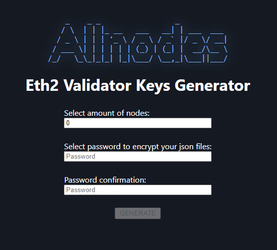
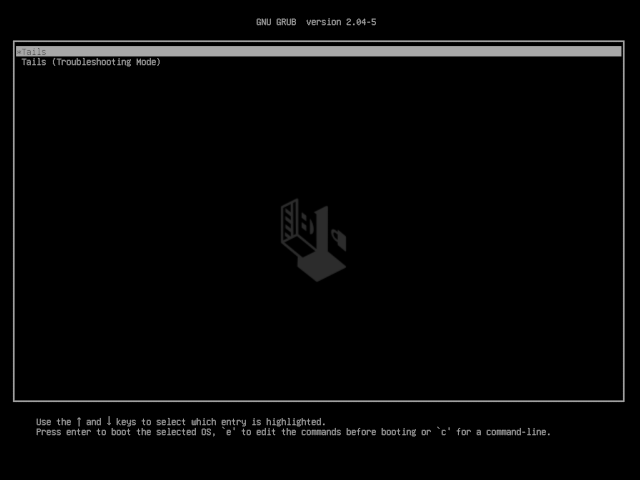

# Signing up to be a validator at the Launchpad

1. Install dependencies, the Ethereum Foundation deposit tool and generate your two sets of key pairs.


Each validator will have two sets of key pairs. A **signing key** and a **withdrawal key.** These keys are derived from a single mnemonic phrase. [Learn more about keys.](https://blog.ethereum.org/2020/05/21/keys/)


You have the choice of downloading the pre-built [ethereum foundation deposit tool](https://github.com/ethereum/eth2.0-deposit-cli) or building it from source. Alternatively, if you have a **Ledger Nano X/S or Trezor Model T**, you're able to generate deposit files with keys managed by a hardware wallet.



Install dependencies.

```
sudo apt update
sudo apt install python3-pip git -y
```


Download source code and install.

```
cd $HOME
git clone https://github.com/ethereum/staking-deposit-cli
cd staking-deposit-cli
sudo ./deposit.sh install
```


Make a new mnemonic.

```
./deposit.sh new-mnemonic --chain mainnet
```



**Advanced option**: Custom eth1 withdrawal address, often used for 3rd party staking.

```bash
# Add the following
--eth1_withdrawal_address <eth1 address hex string>
# Example
./deposit.sh new-mnemonic --chain mainnet --eth1_withdrawal_address 0x1...x
```

If this field is set and valid, the given Eth1 address will be used to create the withdrawal credentials. Otherwise, it will generate withdrawal credentials with the mnemonic-derived withdrawal public key in [EIP-2334 format](https://eips.ethereum.org/EIPS/eip-2334#eth2-specific-parameters).




Download staking\_deposit-cli

```bash
cd $HOME
wget https://github.com/ethereum/staking-deposit-cli/releases/download/v2.3.0/staking_deposit-cli-76ed782-linux-amd64.tar.gz
```


Verify the SHA256 Checksum matches the checksum on the [releases page](https://github.com/ethereum/eth2.0-deposit-cli/releases/tag/v1.0.0).

```bash
echo "8a7757995e70178ac953a746c7434f1bc816a2f4be0318d980bf1eca98930a3c *staking_deposit-cli-76ed782-linux-amd64.tar.gz" | shasum -a 256 --check
```


Example valid output:

> staking\_deposit-cli-76ed782-linux-amd64.tar.gz: OK



Only proceed if the sha256 check passes with **OK**!



Extract the archive.

```
tar -xvf staking_deposit-cli-76ed782-linux-amd64.tar.gz
mv staking_deposit-cli-76ed782-linux-amd64 staking_deposit-cli
rm staking_deposit-cli-76ed782-linux-amd64.tar.gz
cd staking_deposit-cli
```


Make a new mnemonic.

```
./deposit new-mnemonic --chain mainnet
```



**Advanced option**: Custom eth1 withdrawal address, often used for 3rd party staking.

```bash
# Add the following
--eth1_withdrawal_address <eth1 address hex string>
# Example
./deposit.sh new-mnemonic --chain mainnet --eth1_withdrawal_address 0x1...x
```

If this field is set and valid, the given Eth1 address will be used to create the withdrawal credentials. Otherwise, it will generate withdrawal credentials with the mnemonic-derived withdrawal public key in [EIP-2334 format](https://eips.ethereum.org/EIPS/eip-2334#eth2-specific-parameters).




**How to generate validator keys with Ledger Nano X/S and Trezor Model T**



[Allnodes ](https://help.allnodes.com/en/articles/4664440-how-to-setup-ethereum-2-0-validator-node-on-allnodes)has created an easy to use tool to connect a Ledger Nano X/S and Trezor Model T and generate the deposit json files such that the withdrawal credentials remain secured by the hardware wallet. This tool can be used by any validator or staker.



1. Connect your hardware wallet to your PC/laptop
2. If using a Ledger Nano X/S, open the "ETHEREUM" ledger app (if missing, install from Ledger Live)
3. Visit [AllNode's Deposit Generator Tool.](https://wallet.allnodes.com/eth2/generate)
4. Select network > Mainnet
5. Select your wallet > then CONTINUE


6\. From the dropdown, select your eth address with at least 32 ETH to fund your validators

7\. On your hardware wallet, sign the ETH signature message to login to allnodes.com

8\. Again on your hardware wallet, sign another message to verify your eth2 withdrawal credentials


Double check that your generated deposit data file contains the same string as in withdrawal credentials and that this string includes your Ethereum address (starting after 0x)





9\. Enter the amount of nodes (or validators you want)

10\. Finally, enter a **KEYSTORE password** to encrypt the deposit json files. Keep this password safe and **offline**.

11\. Confirm password and click **GENERATE**




:fire:**\[ Optional ] Pro Security Tip**: Run the staking\_deposit-cli tool and generate your **mnemonic seed** for your validator keys on an **air-gapped offline machine booted from usb**.



You will learn how to boot up a windows PC into an airgapped [Tails operating system](https://tails.boum.org/index.en.html).

The Tails OS is an _amnesic_ operating system, meaning it will save nothing and _leave no tracks behind_ each time you boot it.

**Part 0 - Prerequisites**

You need:

* 2 storage mediums (can be USB stick, SD cards or external hard drives)
* One of them must be > 8GB
* Windows or Mac computer
* 30 minutes or longer depending on your download speed

**Part 1 - Download Tails OS**

Download the official image from the [Tails website](https://tails.boum.org/install/index.en.html). Might take a while, go grab a coffee.

Make sure you follow the guide on the Tails website to verify your download of Tails.

**Part 2 - Download and install the software to transfer your Tails image on your USB stick**

For Windows, use one of

* [Etcher](https://tails.boum.org/etcher/Etcher-Portable.exe)
* [Win32 Disk Imager](https://win32diskimager.org/#download)
* [Rufus](https://rufus.ie/en\_US/)

For Mac, download [Etcher](https://tails.boum.org/etcher/Etcher.dmg)

**Part 3 - Making your bootable USB stick**

Run the above software. This is an example how it looks like on Mac OS with etcher, but other software should be similar.


Select the Tails OS image that you downloaded as the image. Then select the USB stick (the larger one).

Then flash the image to the larger USB stick.

**Part 4 - Download and verify the eth2-deposit-cli**

You can refer to the other tab on this guide on how to download and verify the eth2-deposit-cli.

Copy the file to the other USB stick.

**Part 5 - Reboot your computer and into Tails OS**

After you have done all the above, you can reboot. If you are connected by a LAN cable to the internet, you can disconnect it manually.

Plug in the USB stick that has your Tails OS.

On Mac, press and hold the Option key immediately upon hearing the startup chime. Release the key after Startup Manager appears.

On Windows, it depends on your computer manufacturer. Usually it is by pressing F1 or F12. If it doesn't work, try googling "Enter boot options menu on \[Insert your PC brand]"

Choose the USB stick that you loaded up with Tails OS to boot into Tails.

**Part 6 - Welcome to Tails OS**



You can boot with all the default settings.

**Part 7 - Run the staking\_deposit-cli**

Plug in your other USB stick with the `staking_deposit-cli` file.

You can then open your command line and navigate into the directory containing the file. Then you can continue the guide from the other tab.

Make a new mnemonic.

```
./deposit.sh new-mnemonic --chain mainnet
```

If you ran this command directly from your non-Tails USB stick, the validator keys should stay on it. If it hasn't, copy the directory over to your non-Tails USB stick.


:fire: **Make sure you have saved your validator keys directory in your other USB stick (non Tails OS) before you shutdown Tails. Tails will delete everything saved on it after you shutdown.**.



:tada: Congrats on learning how to use Tails OS to make an air gapped system. As a bonus, you can reboot into Tails OS again and connect to internet to surf the dark web or clear net safely!


Alternatively, follow this [ethstaker.cc](https://ethstaker.cc) exclusive for the low down on making a bootable usb.

**Part 1 - Create a Ubuntu 20.04 USB Bootable Drive**

Video link: [https://www.youtube.com/watch?v=DTR3PzRRtYU](https://www.youtube.com/watch?v=DTR3PzRRtYU)

**Part 2 - Install Ubuntu 20.04 from the USB Drive**

Video link: [https://www.youtube.com/watch?v=C97\_6MrufCE](https://www.youtube.com/watch?v=C97\_6MrufCE)

You can copy via USB key the pre-built staking\_deposit-cli binaries from an online machine to an air-gapped offline machine booted from usb. Make sure to disconnect the ethernet cable and/or WIFI.



2\. If using **staking\_deposit-cli**, follow the prompts and pick a **KEYSTORE password**. This password encrypts your keystore files. Write down your mnemonic and keep this safe and **offline**.


**Caution**: Only deposit the 32 ETH per validator if you are confident your execution client  and consensus client will be fully synched and ready to perform validator duties. You can return later to launchpad with your deposit-data to finish the next steps.


3\. Follow the steps at [https://launchpad.ethereum.org/](https://launchpad.ethereum.org) while skipping over the steps you already just completed. Study the eth2 phase 0 overview material. Understanding eth staking is the key to success!


:whale: **Batch Depositing Tip**: If you have many deposits to make for many validators, consider using [Abyss.finance's eth2depositor tool.](https://abyss.finance/eth2depositor) This greatly improves the deposit experience as multiple deposits can be batched into one transaction, thereby saving gas fees and saving your fingers by minimizing Metamask clicking.

Source: [https://twitter.com/AbyssFinance/status/1379732382044069888](https://twitter.com/AbyssFinance/status/1379732382044069888)


4\. Back on the launchpad website, upload your`deposit_data-#########.json` found in the `validator_keys` directory.

5\. Connect to the launchpad with your Metamask wallet, review and accept terms.

6\. Confirm the transaction(s). There's one deposit transaction of 32 ETH for each validator.


For instance, if you want to run 3 validators you will need to have (32 x 3) = 96 ETH plus some extra to cover the gas fees.



Your transaction is sending and depositing your ETH to the [official ETH2 deposit contract address.](https://blog.ethereum.org/2020/11/04/eth2-quick-update-no-19/)

**Check**, _double-check_, _**triple-check**_ that the official Eth2 deposit contract address is correct.[`0x00000000219ab540356cBB839Cbe05303d7705Fa`](https://etherscan.io/address/0x00000000219ab540356cbb839cbe05303d7705fa)



**Critical Crypto Reminder:** Keep your mnemonic, keep your ETH.

* Write down your mnemonic seed **offline**. _Not email. Not cloud._
* Multiple copies are better. Best stored in a [_metal seed._](https://jlopp.github.io/metal-bitcoin-storage-reviews/)
* The withdrawal keys will be generated from this mnemonic in the future.
* Make **offline backups**, such as to a USB key, of your **`validator_keys`** directory.

